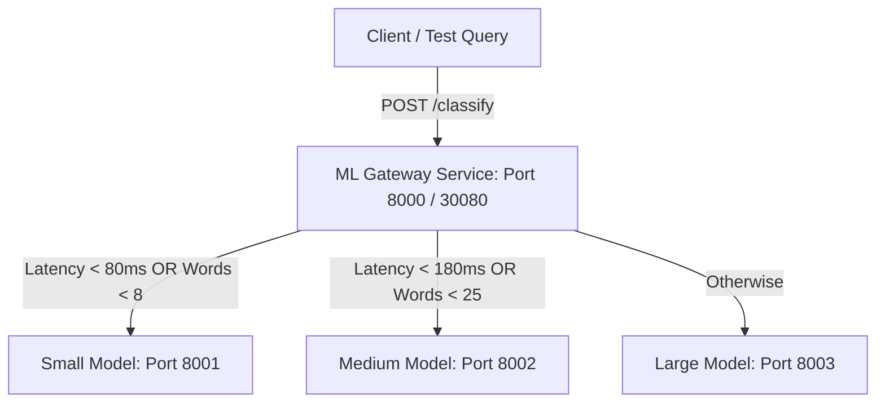

# 🧠 ML Gateway Service

This repository hosts a **production-style MLOps prototype** that demonstrates latency-aware model selection, containerized FastAPI inference services, Kubernetes deployment, and retraining workflow simulation. The system is designed to intelligently route text classification (spam detection) requests to specialized downstream model services based on **latency budgets** and **text complexity**.

This repository is fully configured for native **Windows PowerShell** orchestration using the custom build wrapper `run.ps1`, which interfaces seamlessly with **Minikube** (using its built-in `kubectl` framework) and local Python environments.

---

## 🏗️ System Architecture

The system consists of **four microservices** interacting dynamically:



1. **ML Gateway Service**: Acts as the intelligent reverse proxy router. It evaluates the incoming request text length and user's latency budget to select the best model.
2. **Small Model Service (Naive Bayes)**: Ultra-fast inference (~3ms) optimized for strict latency budgets (< 80ms) or short text (< 8 words).
3. **Medium Model Service (Logistic Regression)**: Balanced speed/accuracy profile optimized for moderate latency budgets (< 180ms) or medium text length (< 25 words).
4. **Large Model Service**: higher-capacity calibrated LinearSVC classifier optimized for accuracy-focused requests.

### 📊 Model Performance & Characteristics

| Model | Algorithm | Avg Latency | Accuracy | Use Case |
|---|---|---:|---:|---|
| **Small** | Naive Bayes | ~3 ms | 98.39% | strict latency or short text |
| **Medium** | Logistic Regression | ~5 ms | 96.77% | balanced speed / accuracy |
| **Large** | LinearSVC (Calibrated) | ~15 ms | 98.03% | higher accuracy with generous budget |

---

## 🛠️ Prerequisites (Windows)

Ensure the following tools are installed on your machine:
* **Python 3.10+** (with virtual environment capability)
* **Docker Desktop** (running and active)
* **Minikube** (installed in `D:\Minikube` or globally in `PATH`)

---

## 🚀 Step-by-Step Deployment Guide (Kubernetes via Minikube)

Follow these steps to deploy and test the entire stack on Kubernetes:

### 1️⃣ Step 1: Start Minikube as Administrator
To use the Hyper-V hypervisor on Windows, Minikube requires elevated network control privileges.
1. Press the **Windows Key**, type **PowerShell**.
2. Right-click **Windows PowerShell** and select **Run as Administrator**.
3. Launch your Minikube cluster:
   ```powershell
   minikube start --driver=hyperv
   ```

### 2️⃣ Step 2: Configure Terminal to Minikube's Docker Daemon
To build the Docker images directly inside Minikube's internal registry (bypassing the need to push to an external registry like Docker Hub), point your terminal to Minikube's Docker daemon:
```powershell
minikube docker-env | Invoke-Expression
```

### 3️⃣ Step 3: Install Workspace Dependencies
Prepare your local python virtualenv and install required scientific modules (Redires cache/temp folders automatically to drive `D:\` to prevent C: drive disk space issues):
```powershell
.\run.ps1 setup
```

### 4️⃣ Step 4: Train the Classifiers
This converts raw dataset formats to a clean RFC CSV dataset and trains all three Scikit-Learn models, saving their serialized pipelines (`model.pkl`):
```powershell
.\run.ps1 train
```

### 5️⃣ Step 5: Build and Deploy using the wrapper
Compile the container images directly into Minikube's registry and apply the Kubernetes manifests. Our script **automatically resolves Minikube's built-in kubectl** if you don't have standalone kubectl installed!
```powershell
# Build Docker images
.\run.ps1 build

# Deploy manifests to Minikube
.\run.ps1 deploy
```

---

## 🧪 Testing the Deployment

Once deployed, the gateway NodePort service is exposed on port **`30080`**. 

You can test the system dynamically using our built-in test target:
```powershell
.\run.ps1 test
```

The script will automatically detect that port `30080` (Kubernetes NodePort) is open and dispatch structured test queries:

### Sample Payload Response (`POST /classify`):
```json
{
    "label": "spam",
    "confidence": 0.9828,
    "selected_model": "small",
    "latency_ms": 3.29,
    "gateway_latency_ms": 12.45
}
```

---

## 🔄 Model Retraining Workflow

This prototype simulates production-style MLOps model lifecycle management via Kubernetes batch Jobs:

```powershell
# Trigger a retraining Job in Kubernetes
.\run.ps1 retrain
```

### How it Works Under the Hood:
1. **Containerized Job Execution**: Applying `k8s/retrain-job.yaml` launches a batch Job executing `train.py` inside the model container image (`ml-gateway/small:v1`).
2. **Dataset & Training**: The training execution compiles features using `data/spam.csv` (which is baked into the model image context) and fits the pipeline.
3. **Simulation Note**: In this local cluster setup, the retrained `model.pkl` is saved within the transient batch container's writable layer. In a full production MLOps pipeline, this Job would push the updated model artifact to a central object store (like S3/GCS) or model registry (like MLflow) and trigger a rolling rollout (`kubectl rollout restart`) to redeploy the serving pods with the new weights.

---

## 💻 Alternative: Running Locally (Non-Kubernetes)

If you wish to develop or test the microservices quickly without starting a Kubernetes cluster, you can run the entire microservices stack directly as native Python background processes:

```powershell
# Spin up all 4 services in the background (Ports 8000, 8001, 8002, 8003)
.\run.ps1 local

# Test the local services (automatically detects port 8000 is open!)
.\run.ps1 test

# Stop the background processes when you are finished
.\run.ps1 stop
```
*Processes PIDs are tracked in `temp/pids.txt` and logging outputs are directed to separate `.log` files in the `temp/` folder.*

---

## 🧹 Cleanup

To delete all Kubernetes pods, deployments, services, and local models, run:
```powershell
.\run.ps1 clean
```
